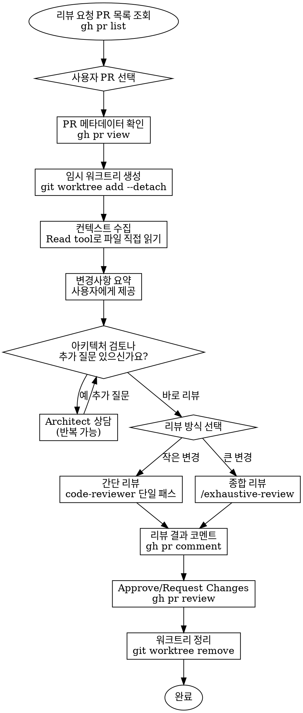

# Pull Request 리뷰

## 개요

PR 리뷰 워크플로우. **PR 목록 조회 → 사용자 선택** → 워크트리 생성 → 컨텍스트 수집 → 요약 → Architect 상담(선택) → 코드 리뷰 → 코멘트/승인 → 워크트리 정리.

**핵심 원칙: 현재 브랜치를 절대 변경하지 않는다. 항상 임시 워크트리에서 리뷰한다.**

## 프로젝트 설정

프로젝트에 설정 파일(`rules/project-params.md`)이 있으면 다음 설정을 읽는다:
- `base_branch`: PR base 브랜치 (기본값: `gh repo view --json defaultBranchRef`로 자동 감지)
- `fork_workflow`: fork 기반 워크플로우 여부 (기본값: false)
  - `true`: PR fetch 시 `upstream` remote 사용
  - `false` 또는 미설정: `origin` remote 사용

## 워크플로우



## 단계별 설명

### 0. 리뷰 요청 PR 목록 조회 & 선택

스킬 시작 시 사용자에게 PR 번호를 묻지 말고, 먼저 리뷰 요청된 PR 목록을 자동으로 가져와 제시한다.

```bash
# 나에게 리뷰 요청된 PR 목록 조회
gh pr list --search "review-requested:@me" --json number,title,author,additions,deletions,changedFiles,headRefName --limit 20
```

결과를 테이블 형태로 사용자에게 제시:

| # | 제목 | 작성자 | 변경 |
|---|------|--------|------|
| 1234 | feat: ... | author-name | +N/-N, N files |

- PR이 **0개**인 경우: "리뷰 요청된 PR이 없습니다." 출력 후 종료
- PR이 **1개**인 경우: 해당 PR을 자동 선택하고 사용자에게 알림 후 진행
- PR이 **2개 이상**인 경우: `AskUserQuestion`으로 사용자에게 어떤 PR을 리뷰할지 선택하게 함

### 1. PR 확인 & 워크트리 생성

```bash
# PR 메타데이터 확인 (현재 디렉토리에서 실행 가능)
gh pr view <number> --json title,body,additions,deletions,changedFiles,commits,headRefName,baseRefName,files

# PR remote 판별
# rules/project-params.md의 fork_workflow=true → upstream remote 사용
# fork_workflow=false 또는 미설정 → origin remote 사용
REMOTE="upstream"  # or "origin"

# PR ref로 fetch — fork PR이든 같은 repo PR이든 이 방법이 항상 동작
git fetch $REMOTE pull/<number>/head:pr-<number>

# 워크트리 생성 (현재 브랜치 변경 없음)
git worktree add --detach /tmp/pr-review-<number> pr-<number>
```

**왜 `origin/<branch-name>`을 직접 쓰면 안 되는가:**
- fork-based workflow에서 `origin`은 사용자 개인 fork이고, PR 브랜치는 다른 사람의 fork에 있음
- `git fetch <remote> pull/<number>/head:pr-<number>` 패턴이 fork 여부와 무관하게 항상 동작

**절대 `gh pr checkout`이나 `git checkout`을 사용하지 않는다.**

### 2. 컨텍스트 수집 (Read tool 사용)

워크트리에서 직접 파일을 읽어서 리뷰 컨텍스트를 구성한다:

```
# diff 확인 -- 이것만 Bash 사용
git diff <base-branch>...HEAD -- (워크트리 경로에서 실행)

# 변경된 파일의 전체 내용은 Read tool로 직접 읽기
Read("/tmp/pr-review-<number>/path/to/changed/file.ts")
```

**중요: 에이전트에게 위임할 때는 diff와 파일 내용을 프롬프트에 직접 포함시킨다. 에이전트가 스스로 git 명령어를 실행하게 하면 안 된다.**

### 3. 변경사항 요약 제공

수집한 컨텍스트를 바탕으로 사용자에게 요약:
- 변경 규모 (+N/-N, N files)
- 주요 변경사항 목록
- 영향받는 레이어 (UI, 리듀서, 도메인, export 등)

### 4. Architect 상담 옵션 제시 (필수)

**이 질문은 반드시 해야 함 - 스킵 금지:**
> "코드 리뷰 전에 아키텍처 검토나 추가 질문이 있으신가요?"

옵션 제시:
1. **아키텍처 검토** - 설계 적절성 논의
2. **히스토리 분석** - 변경 이력/맥락 파악
3. **유사 코드 탐색** - 비슷한 패턴 구현 확인
4. **바로 리뷰 진행**

- 사용자가 1-3 선택 시: Architect 에이전트(`subagent_type="oh-my-claudecode:architect"`)로 상담 수행, 완료 후 다시 질문
- 사용자가 4 선택 시: 다음 단계로 진행

**중요:** 에이전트가 이 질문을 스킵하면 안 됨. 사용자가 "바로 리뷰"를 선택하는 것은 OK.

### 5. 리뷰 방식 선택

사용자에게 질문:
- **간단 리뷰**: 작은 변경, 빠른 검토 → `Task(subagent_type="oh-my-claudecode:code-reviewer", model="sonnet", ...)` 단일 패스 리뷰
- **종합 리뷰**: 큰 변경, 3-persona 토론 → `/exhaustive-review`

### 6. 코드 리뷰 실행

선택에 따라 실행. **에이전트 위임 시 diff 크기에 따라 전략을 분리한다:**

#### 작은 diff (<3000줄)
- diff + 주요 변경 파일의 전문을 프롬프트에 직접 포함
- 에이전트에게 "Bash/Glob/Grep 사용 금지, 제공된 컨텍스트만으로 리뷰" 명시
- 에이전트가 도구를 사용할 필요 없음

#### 큰 diff (≥3000줄)
- diff 요약(stat + 핵심 섹션)을 프롬프트에 포함
- **워크트리 경로(`/tmp/pr-review-<number>/`)를 제공**하여 에이전트가 Read로 파일 확인 가능
- 에이전트에게 "Bash/Glob/Grep 사용 금지, **Read만 허용하며 반드시 워크트리 경로에서 읽을 것**" 명시
- 변경 파일 목록을 명시하여 해당 파일만 Read하도록 제한

**주의:** 워크트리 경로 없이 Read를 허용하면 에이전트가 CWD(현재 브랜치)의 파일을 읽어서 PR 변경사항이 없는 구버전을 보고 거짓 양성 이슈를 제기할 수 있다.

### 7. 결과 코멘트 & Approve

```bash
gh pr comment <number> --body "..."
gh pr review <number> --approve --body "..."
```

### 8. 워크트리 정리

```bash
git worktree remove /tmp/pr-review-<number>
```

## 에이전트 위임 규칙

에이전트(Task tool)에게 리뷰를 위임할 때 반드시 지키는 규칙:

1. **Bash/Glob/Grep 사용 금지 명시**: 프롬프트에 "Do NOT use Bash, Glob, or Grep." 포함
2. **컨텍스트 전략 (diff 크기에 따라 분기)**:
   - **작은 diff (<3000줄)**: diff + 주요 변경 파일의 전문을 프롬프트에 직접 포함. 에이전트가 도구를 사용할 필요 없음.
   - **큰 diff (≥3000줄)**: diff 요약을 프롬프트에 포함하고, **워크트리 경로(`/tmp/pr-review-<number>/`)를 명시**하여 에이전트가 Read로 파일을 읽을 수 있게 함. 반드시 "Read는 워크트리 경로에서만 사용할 것" 명시.
3. **CWD 파일 읽기 금지**: 에이전트에게 워크트리 경로 없이 Read를 허용하면 CWD(= 현재 base 브랜치)의 구버전 파일을 읽어 거짓 양성 이슈를 제기함. **Read를 허용할 때는 반드시 워크트리 경로를 함께 제공**해야 한다.
4. **mode 설정**: 읽기 전용 리뷰는 `mode: "bypassPermissions"` 가능

## 주의 신호

이 생각이 들면 STOP:

| 생각 | 현실 |
|------|------|
| "gh pr checkout으로 빨리 체크아웃하자" | 현재 작업 브랜치가 오염됨. 워크트리를 써야 함 |
| "origin/<branch>로 바로 워크트리 만들자" | fork PR은 origin에 없음. `git fetch <remote> pull/<n>/head:pr-<n>` 패턴 사용 |
| "에이전트가 알아서 diff를 읽겠지" | 에이전트가 git 명령어를 실행하면 permission prompt 발생 |
| "에이전트에게 Read만 허용하면 되지" | 워크트리 경로 없이 Read를 허용하면 CWD(base 브랜치)의 구버전 파일을 읽어 거짓 양성 발생 |
| "Architect 상담은 시간 낭비" | 아키텍처 이해 없이 리뷰하면 더 큰 시간 낭비 |
| "작은 PR이라 바로 리뷰해도 됨" | 작아도 설계 질문이 있을 수 있음. 물어봐야 함 |
| "워크트리 정리는 나중에" | 즉시 정리. 안 하면 쌓임 |

## 빠른 참조

| 단계 | 명령어/도구 |
|------|-------------|
| PR 목록 조회 | `gh pr list --search "review-requested:@me" --json ...` |
| PR 선택 | `AskUserQuestion` (2개 이상일 때) |
| PR 메타데이터 | `gh pr view <number> --json ...` |
| PR fetch | `git fetch <remote> pull/<number>/head:pr-<number>` |
| 워크트리 생성 | `git worktree add --detach /tmp/pr-review-<number> pr-<number>` |
| Diff | `git diff <base>...HEAD` (워크트리에서) |
| 파일 읽기 | `Read("/tmp/pr-review-<number>/path/to/file")` |
| Architect 상담 | `Task` tool with `subagent_type="oh-my-claudecode:architect"` |
| 간단 리뷰 | `Task(subagent_type="oh-my-claudecode:code-reviewer", model="sonnet")` |
| 종합 리뷰 | `/exhaustive-review` |
| 코멘트 | `gh pr comment <number> --body "..."` |
| 승인 | `gh pr review <number> --approve` |
| 워크트리 정리 | `git worktree remove /tmp/pr-review-<number>` |

## 절대 규칙

- **무거운 작업은 위임한다** — `_shared/delegation-policy.md` 참조
