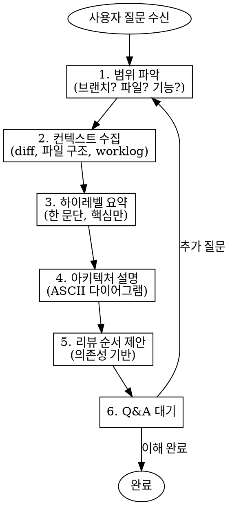

# 코드 설명

## 개요

사용자가 코드 변경사항이나 현재 코드 구조를 이해할 수 있도록 돕는 스킬. 하이레벨 설명, 아키텍처 다이어그램, 리뷰 순서를 제공한다.

## 사용 시점

- 브랜치의 변경사항을 이해하고 싶을 때
- 특정 기능/모듈의 아키텍처를 파악하고 싶을 때
- 코드 리뷰 순서를 알고 싶을 때
- "이거 어떻게 동작해?", "뭐가 바뀐 거야?" 같은 질문

## 워크플로우



## 프로젝트 설정

스킬 시작 시 프로젝트 설정 파일(`rules/project-params.md`)을 읽어 다음 설정을 가져온다:

| 설정 | 기본값 | 용도 |
|------|--------|------|
| `base_branch` | (자동 탐지: `gh repo view --json defaultBranchRef`) | diff 기준 브랜치 |
| `fork_workflow` | `false` | true면 `upstream` remote, false면 `origin` remote 사용 |

`base_branch` 결정 로직:
1. `rules/project-params.md`에 `base_branch`가 있으면 사용 (e.g., `upstream/develop`)
2. 없으면 `gh repo view --json defaultBranchRef`로 자동 탐지
3. 자동 탐지도 실패하면 사용자에게 질문 → `project_memory_add_note("base_branch: {answer}")`

## 단계 상세

### 1. 범위 파악

사용자에게 무엇을 이해하고 싶은지 확인:

| 범위 | 확인 방법 |
|------|----------|
| 브랜치 전체 | `git log --oneline {base_branch}..HEAD` |
| 특정 커밋 | `git show <commit>` |
| 특정 파일/디렉토리 | `git diff {base_branch} -- <path>` |
| 현재 코드 상태 | 파일 읽기 + 구조 분석 |

### 2. 컨텍스트 수집

- **Worklog 확인**: `.claude/worklogs/` 에서 관련 worklog 검색
- **변경 파일 목록**: `git diff --stat {base_branch}..HEAD`
- **핵심 파일 식별**: 변경량 + 중요도 기준

**서브에이전트 활용 (필수)**:

코드 탐색 시 서브에이전트를 최대한 활용하여 컨텍스트를 효율적으로 수집한다.

| 작업 | 서브에이전트 | 예시 |
|------|-------------|------|
| 코드베이스 탐색 | `explore` (haiku) | 아키텍처 파악, 파일 관계 분석 |
| 심층 분석 | `architect` | 복잡한 의존성, 설계 의도 파악 |
| 특정 패턴 검색 | Grep tool | 특정 함수/타입 사용처 추적 |
| 병렬 파일 분석 | 여러 에이전트 동시 | 독립적인 모듈 동시 분석 |

```
# 예시: 3개 에이전트 병렬로 컨텍스트 수집
Task(explore): "playerController 디렉토리 구조와 역할 분석"
Task(explore): "Core player 컴포넌트들의 관계 분석"
Task(explore): "Redux videoplay 관련 변경사항 분석"
```

### 3. 하이레벨 요약

**한 문단**으로 핵심을 설명:

```
이 브랜치는 [목적]을 위해 [주요 변경]을 수행했습니다.
핵심 변경은 [파일/모듈]이며, [기존 방식]에서 [새 방식]으로 전환했습니다.
```

### 4. 아키텍처 설명

ASCII 다이어그램으로 구조 표현:

```
[Before]                          [After]
Redux videoplay ─┬─> VideoPlayer   IPlayerController (interface)
                 └─> Components         ├─> LegacyAdapter ─> VideoPlayer
                                        └─> CoreAdapter ─> PreviewController
```

**포함할 내용**:
- 주요 컴포넌트/모듈 관계
- 데이터 흐름 방향
- Before/After 비교 (리팩토링인 경우)

### 5. 리뷰 순서 제안

의존성 기반으로 읽는 순서 제안:

```markdown
## 추천 리뷰 순서

1. **types/core/playerController.ts** - 인터페이스 정의 (다른 모든 것의 기반)
2. **hooks/playerController/LegacyPlayerAdapter.ts** - 기존 구현 어댑터
3. **hooks/playerController/CorePlayerAdapter.ts** - 신규 구현 어댑터
4. **hooks/playerController/PlayerControllerContext.tsx** - Context 제공
5. **components/core/player/PlayerPanel.tsx** - 실제 사용처
```

**순서 결정 기준**:
- 타입/인터페이스 → 구현 → 사용처
- 추상화 레이어 → 구체적 구현
- 변경량 적은 것 → 많은 것

### 6. Q&A

사용자 질문에 답변하며 반복:

- 특정 파일 상세 설명 요청 → 해당 파일 읽고 설명
- 왜 이렇게 했는지 → worklog Decision 섹션 참조
- 다른 방법은 없었는지 → 대안 분석 제공

## 출력 형식

```markdown
## 하이레벨 요약
[한 문단 설명]

## 아키텍처
[ASCII 다이어그램]

## 주요 변경 파일 (N개)
| 파일 | 역할 | 변경 내용 |
|------|------|----------|
| ... | ... | ... |

## 추천 리뷰 순서
1. [파일] - [이유]
2. ...

## 질문 있으신가요?
```

## 흔한 실수

| 실수 | 해결 |
|------|------|
| 너무 상세하게 시작 | 하이레벨 요약부터, 상세는 요청 시 |
| 파일 나열만 함 | 관계와 흐름을 설명해야 함 |
| 리뷰 순서 없음 | 의존성 기반 순서 필수 제공 |
| worklog 무시 | Decision, Strategy 섹션에 맥락 있음 |

## 절대 규칙

- **무거운 작업은 위임한다** — `_shared/delegation-policy.md` 참조
